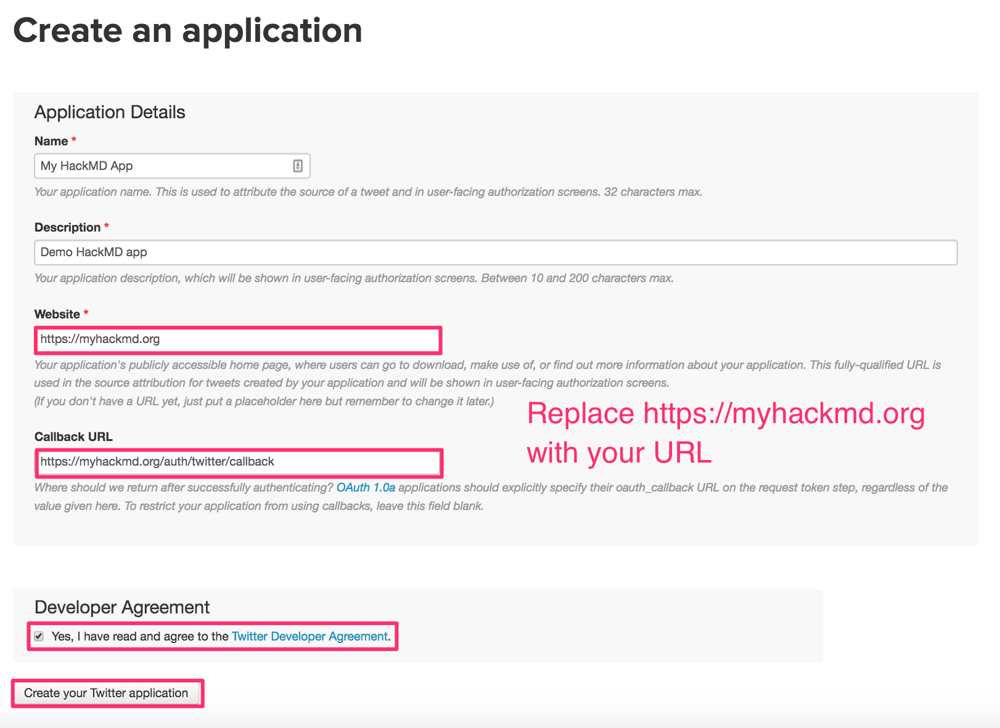
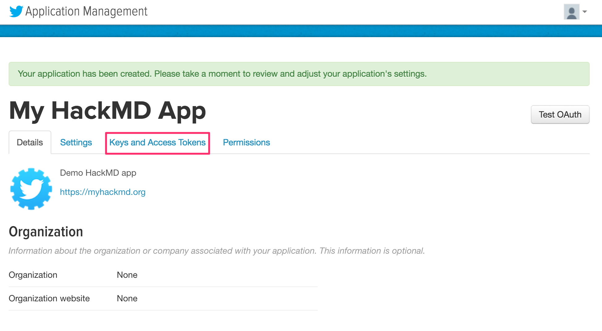
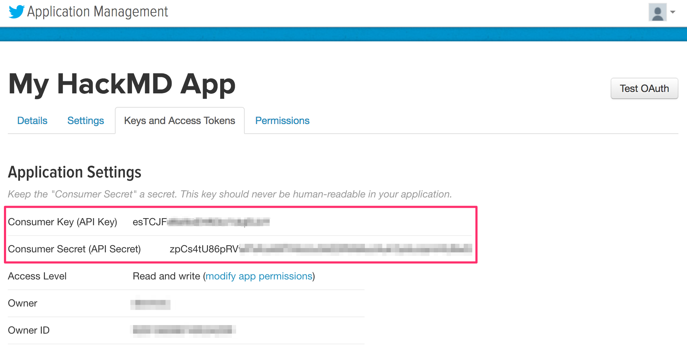
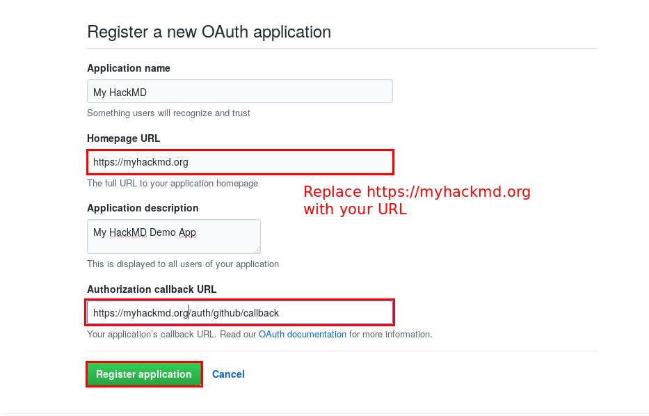
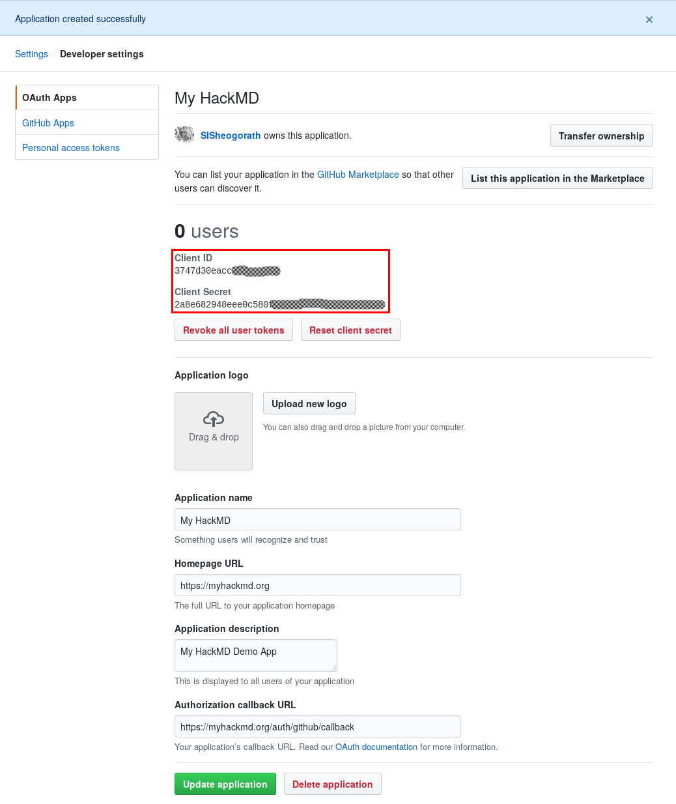

# Guide - Authentication

### Twitter
1. Sign-in or sign-up for a Twitter account
2. Go to the Twitter Application management page [here](https://apps.twitter.com/)
3. Click on the **Create New App** button to create a new Twitter app:


4. Fill out the create application form, check the developer agreement box, and click **Create Your Twitter Application**



*Note: you may have to register your phone number with Twitter to create a Twitter application*

To do this Click your profile icon --> Settings and privacy --> Mobile  --> Select Country/region --> Enter phone number --> Click Continue

5. After you receive confirmation that the Twitter application was created, click **Keys and Access Tokens**



6. Obtain your Twitter Consumer Key and Consumer Secret



7.  Add your Consumer Key and Consumer Secret to your config.json file or pass them as environment variables:
    * config.json:
      ````javascript
      {
        "production": {
          "twitter": {
              "consumerKey": "esTCJFXXXXXXXXXXXXXXXXXXX",
              "consumerSecret": "zpCs4tU86pRVXXXXXXXXXXXXXXXXXXXXXXXXXXXXXXXXXXXXXX"
          }
        }
      }
      ````
    * environment variables:
      ````
      HMD_TWITTER_CONSUMERKEY=esTCJFXXXXXXXXXXXXXXXXXXX
      HMD_TWITTER_CONSUMERSECRET=zpCs4tU86pRVXXXXXXXXXXXXXXXXXXXXXXXXXXXXXXXXXXXXXX
      ````

### GitHub
1. Sign-in or sign-up for a GitHub account
2. Navigate to developer settings in your GitHub account [here](https://github.com/settings/developers) and select the "OAuth Apps" tab
3. Click on the **New OAuth App** button, to create a new OAuth App: 


4. Fill out the new OAuth application registration form, and click **Register Application**



*Note: The callback URL is <your-hackmd-url>/auth/github/callback*

5. After successfully registering the application, you'll receive the Client ID and Client Secret for the application



6. Add the Client ID and Client Secret to your config.json file or pass them as environment variables
    * config.json:
      ````javascript
      {
        "production": {
          "github": {
              "clientID": "3747d30eaccXXXXXXXXX",
              "clientSecret": "2a8e682948eee0c580XXXXXXXXXXXXXXXXXXXXXX"
          }
        }
      }
      ````
    * environment variables:
      ````
      HMD_GITHUB_CLIENTID=3747d30eaccXXXXXXXXX
      HMD_GITHUB_CLIENTSECRET=2a8e682948eee0c580XXXXXXXXXXXXXXXXXXXXXX
      ````
